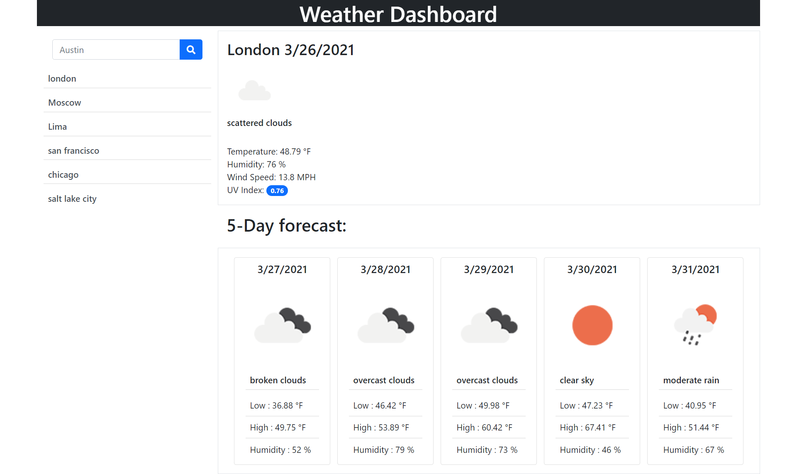

# Weather Dashboard - Challenge #6

Hello there and welcome to my Weather Dashboard. This small application will give you the most accurate weather information for Today and the next 5 days ahead. You will also be able to find the information from past searches to save you some time, in addition to being able to see the UV conditions out there.

You can learn more about how to protect yourself from harmful UV rays here : https://www.epa.gov/sites/production/files/documents/uviguide.pdf.

## Tech used

This application relies heavily on the use of **fetch()** and **tree traversal selectors**

Mostly all elements are dynamically created using **Jquery**, which we decided to use thanks to how easy it is to select areas and reduce the sheer amount of code written.

Additionally, **Bootstrap 5** was used heavily to provide a uniform experience to the user when navigating the web. Bootstrap also made dynamic creation of elements much easier, since we were able to apply properties and styles directly witough having to swith to a CSS file.

## 3rd party API's

We used two API's from OpenWeatherMap:

https://openweathermap.org/current for current day data.

and 

https://openweathermap.org/api/one-call-api for weekly data.

We considered using Moment.JS to feth the data for the dates, but thankfully, both API's privided us with a *dt* item in the responses that we were able to convert to our desired format ( thank you google for helping us figure that out)

## Bonus

Please feel free to read through the JS file , as we have added a pletora of comments to help you navigate through our thought process.

Finally, here is how the finished app looks like:

## Review

Please be sure to check my work by following the links below:

* Deployed link https://sergioloman.github.io/Sergioloman06.github.io/

* Repository https://github.com/Sergioloman/Sergioloman06.github.io

- - -
As always, thank you for stopping by and happy coding!
